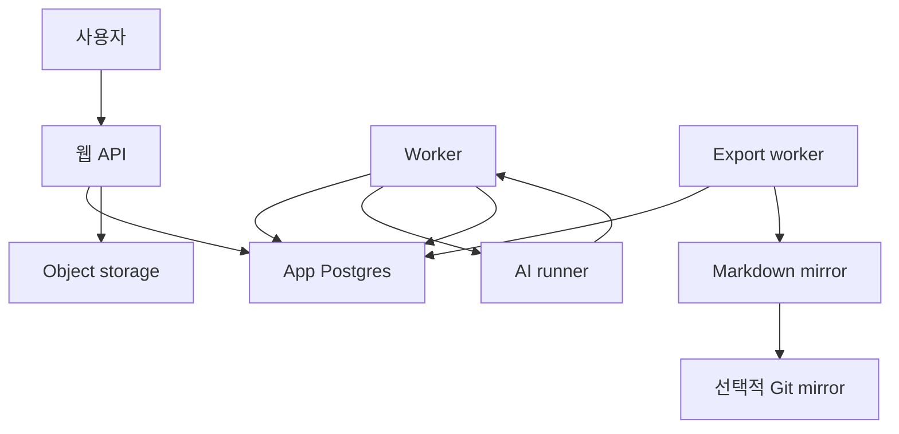

# DB 중심 전환 계획

이 문서는 `llm-wiki`를 DB 중심 구조로 명확히 전환하기 위한 실행 계획이다. 목표는 웹서비스를 기준 사용 경로로 삼고, Git이나 외부 Markdown 도구를 원본 저장소가 아니라 선택적 mirror 또는 import/export 경로로 낮추는 것이다.

## 결론

- App Postgres가 노트, 리비전, 관계, 제안, 피드백, 일정, 알림, 대화의 canonical storage가 된다.
- MinIO/S3 호환 object storage가 첨부파일의 canonical storage가 된다.
- Git mirror는 Markdown export를 저장하고 싶은 경우에만 쓰는 파생 저장소이며, 런타임 기본 구성은 DB와 object storage를 기준으로 한다.
- ORM은 도입하지 않고, 기존 원칙대로 raw SQL과 명시적 repository 함수를 사용한다.

## 현재 상태

이미 DB 중심 구조의 상당 부분은 구현되어 있다.

| 영역 | 현재 상태 | 전환 필요성 |
| --- | --- | --- |
| 노트 저장 | `notes`, `note_revisions`, `note_links`, `note_feedback`가 App DB에 있음 | DB canonical 선언을 런타임 기본값까지 확정 |
| AI 처리 | `db-note` input mode가 있고 worker가 DB 노트를 처리함 | Git 기반 요청 경로를 보조 경로로 낮춤 |
| Markdown mirror | `export_jobs`, `export_mirror.py`, 수동/자동 export가 있음 | mirror 실패가 본 기능을 막지 않도록 분리 |
| Git inbox | 과거 Git inbox 변경 감지 | W6에서 기본 런타임과 설정 모델에서 제거 |
| 백업 | DB dump, Git bundle, object archive가 있음 | DB dump와 object archive를 1차 백업으로 격상 |

## 목표 아키텍처

핵심 규칙은 단순하다. 사용자의 쓰기, AI 처리 결과, 승인된 연결, 일정/알림, 대화 이력은 모두 DB에 먼저 저장한다. Markdown mirror와 Git push는 이후 별도 작업으로 처리한다.

## 데이터 소유권

| 데이터 | 원본 | 파생/보조 |
| --- | --- | --- |
| 작성중 메모와 원문 | App DB | Markdown mirror |
| AI 소스 노트 | App DB | Markdown mirror |
| 주제, 대상, 태그 연결 | App DB | Markdown mirror frontmatter 또는 본문 요약 |
| AI 제안과 승인/거절 상태 | App DB | 없음 또는 감사용 export |
| 문서 피드백 | App DB | 소스 노트 export에 요약 가능 |
| 일정, 할 일, 알림 | App DB | iCalendar/export는 향후 선택 기능 |
| 대화 이력과 근거 | App DB 또는 브라우저 로컬 저장소, 기능 성격에 따라 결정 | 없음 |
| 첨부파일 bytes | Object storage | backup archive |
| 첨부파일 메타데이터 | App DB | Markdown 링크 |
| Markdown export job | App DB + mirror directory | 감사용 산출물 |

## 전환 원칙

1. DB 쓰기는 Markdown mirror 상태와 독립적으로 성공해야 한다.
2. Git mirror 장애는 export 지연으로만 표시하고, 노트 작성/수정/AI 처리/검색을 막지 않는다.
3. Markdown 파일은 사람이 직접 수정하는 원본이 아니라 DB에서 재생성 가능한 산출물로 취급한다.
4. import는 허용하지만, import 후에는 DB의 revision과 relation으로 관리한다.
5. 백업 복구의 기준은 DB dump와 object archive이며, Git bundle은 보조 검증 자료다.
6. 사용자 UI 문구는 `저장소 반영`보다 `마크다운 내보내기`, `백업 mirror 반영`처럼 파생 작업임을 드러낸다.

## 작업 흐름별 계획

### 1. 설정과 용어 정리

- `VAULT_PATH`의 의미를 `Markdown mirror path`로 재정의한다.
- 새 환경변수 `MIRROR_PATH`를 도입하고 `VAULT_PATH`는 호환 alias로 유지한다.
- Git inbox 자동 감지 설정은 W6에서 제거한다.
- `WORKER_DB_NOTE_AUTO_EXPORT_ENABLED`는 선택 기능으로 유지하고, 실패 시 요청 성공 상태를 되돌리지 않는다.
- UI와 문서에서 `저장소 반영`을 `마크다운 내보내기`로 통일한다.

완료 기준:

- Git mirror 설정이 없어도 앱이 시작되고 노트 작성, AI 처리, 검색이 가능하다.
- 운영 화면에서 mirror 상태는 별도 보조 상태로 표시된다.

### 2. 요청 생명주기 DB-first 정리

- 웹에서 생성되는 모든 처리 요청은 `input_mode='db-note'`를 기본으로 한다.
- Git inbox 자동 감지는 W6 이후 기본 런타임에서 제거한다.
- DB 노트 AI 처리는 `DB_NOTE_RUN_ROOT` 아래 임시 작업공간만 사용하고, Git cache/worktree 인증 상태에 의존하지 않는다.
- `needs_sync` 상태는 Git sync 문제보다 DB revision mismatch를 표현하도록 의미를 좁힌다.

완료 기준:

- Git checkout이 없거나 깨져도 웹 작성/AI 처리 요청은 정상 처리된다.
- DB 노트 요청 성공 시 `branch_name`, `pr_url`은 비워 두고 DB 대상 노트 ID를 결과로 삼는다.
- 재분석은 원문 revision, 현재 source, 열린 feedback을 DB에서 읽어 수행한다.

### 3. AI runner 어댑터 정리

현재 Codex CLI runner는 임시 Markdown vault를 만들어 처리한다. 이 방식은 당장 유지할 수 있지만, 외부에는 DB-first로 보여야 한다.

- 임시 vault는 runner adapter 내부 구현으로만 남긴다.
- runner 입출력 계약은 DB note와 structured result를 기준으로 문서화한다.
- OpenAI API runner는 Markdown 파일 변경보다 JSON/structured output을 우선하도록 확장한다.
- topic/entity 파일 직접 생성은 금지하고, DB suggestion으로만 생성한다.

완료 기준:

- worker 결과 저장은 파일 diff가 아니라 DB mutation 결과를 기준으로 검증된다.
- runner가 만든 topic/entity 후보는 항상 제안 테이블을 거쳐 승인된다.

### 4. Markdown mirror 재정의

- mirror는 DB에서 재생성 가능한 산출물이다.
- export job은 `queued`, `running`, `succeeded`, `failed` 상태를 갖는 비동기 작업으로 취급한다.
- 노트 저장 또는 AI 처리 성공과 mirror 성공을 분리한다.
- full export와 incremental export를 모두 지원한다.
- 삭제/연결 변경/제안 승인 결과가 mirror에 일관되게 반영되도록 full reconciliation 명령을 제공한다.
- `llm-wiki notes-export --scope full --local-only --reconcile`은 DB 기준 Markdown을 다시 쓰고, generated stale Markdown 파일을 삭제한다.
- `--dry-run --reconcile`은 삭제 후보를 `stale_paths`/`deleted_paths`로 보고만 한다.
- stale 삭제는 `llm_wiki_note_id` frontmatter가 있는 generated 파일로 제한해 수동 Markdown을 건드리지 않는다.

완료 기준:

- `llm-wiki notes-export --scope full --local-only --reconcile`로 mirror를 DB 기준으로 재생성할 수 있다.
- mirror 경로 충돌, 삭제 잔여 파일, export lag를 운영 화면에서 확인할 수 있다.

### 5. 백업과 복구 기준 변경

- 1차 백업은 App Postgres dump다.
- 첨부파일 백업은 DB의 `note_assets`와 object metadata를 기준으로 만든다.
- 현재처럼 Markdown mirror를 스캔해 object reference를 찾는 방식은 보조 검증으로 낮춘다.
- Git bundle은 별도 mirror를 운영할 때만 보조 백업으로 분리한다.
- restore smoke는 DB restore, object restore, mirror regeneration 순서로 수행한다.

완료 기준:

- Git mirror 백업 없이도 DB와 object archive만으로 서비스 핵심 데이터가 복구된다.
- 복구 후 full export를 실행하면 Markdown mirror가 다시 생성된다.

### 6. UI와 운영 화면 정리

- 노트 우측의 `마크다운 저장소 반영`은 `마크다운 내보내기`로 변경한다.
- export 결과는 노트 저장/AI 처리 성공과 별도 상태로 보여준다.
- 운영 화면에 `DB`, `Worker`, `Object storage`, `Mirror export`를 분리해 표시한다.
- Git mirror가 미설정이면 경고가 아니라 `mirror disabled`로 표시한다.

완료 기준:

- 사용자는 DB 저장이 완료된 것과 mirror 반영이 완료된 것을 혼동하지 않는다.
- 작은 화면에서도 mirror 관련 정보가 핵심 노트 작업을 방해하지 않는다.

### 7. Markdown/Git Mirror 역할 재정리

- Markdown import/export는 DB 기준 산출물 또는 가져오기 경로로만 유지한다.
- Git mirror가 필요하면 외부 Git remote를 별도로 연결한다.
- 별도 입력 클라이언트는 기본 설치와 공개 문서에서 제공하지 않는다.

완료 기준:

- 신규 사용자는 외부 Markdown 도구나 Git 없이도 서비스를 설치하고 사용할 수 있다.

## 단계별 로드맵

### W1. DB-first 용어와 기본값 정리

- `MIRROR_PATH` alias 추가
- Git inbox 자동 감지 설정 제거
- UI 문구를 `마크다운 내보내기`로 변경
- 문서에서 외부 Markdown 도구를 선택 기능으로 재분류

검증:

- Git mirror env 없이 API가 시작되는지 확인
- 기존 운영 환경에서는 현재 `.env`로 동작 유지

### W2. Git inbox 자동 감지 제거 준비

- Git inbox 자동 감지를 운영 기본 경로에서 제외
- Git inbox 변경 감지는 W6에서 제거
- request lifecycle 문서에서 기본 생성 경로를 DB request로 정리

검증:

- 웹에서 새 노트 작성 후 AI 처리까지 Git checkout 없이 통과
- Git inbox 자동 감지 없이도 worker가 DB 요청과 알림 dispatch를 처리

### W3. Export mirror 비동기화와 reconciliation

- export job queue/retry 정책 명확화
- full export reconciliation 명령 추가
- mirror stale 상태와 실패 사유를 운영 화면에 표시
- 노트별 export 상태는 보조 정보로 이동

검증:

- mirror path를 비운 뒤 full export로 재생성
- Git push 실패 시 노트 저장/AI 처리 결과는 유지

### W4. 백업/복구 DB 기준 재작성

- object manifest 수집을 DB asset 기준으로 변경
- restore smoke 순서를 DB restore -> object verify -> full export로 변경
- Git bundle을 optional mirror backup으로 분리

검증:

- DB dump와 object archive만으로 핵심 서비스 데이터 복구
- 복구된 DB에서 full export 성공

### W5. Runner 입출력 계약 정리

- DB note runner request schema 문서화
- Codex CLI 임시 vault 의존을 adapter 내부로 격리
- OpenAI API runner는 structured output 경로를 우선 지원

검증:

- 같은 DB note revision을 재분석하면 동일한 target source relation을 유지
- topic/entity 후보는 DB suggestion으로만 생성

### W6. Markdown/Git optional profile 정리

- 설치 매뉴얼에서 최소 구성과 mirror 포함 구성을 분리
- 레거시 Git 서버 배포 템플릿 제거

검증:

- 최소 구성: API, worker, App DB, object storage만으로 동작
- mirror 구성: Git remote를 추가하면 export push가 동작

## 위험과 대응

| 위험 | 영향 | 대응 |
| --- | --- | --- |
| 기존 mirror와 DB가 불일치 | export 결과 혼란 | full reconciliation과 stale marker 제공 |
| Git mirror 제거로 감사 이력 약화 | 변경 추적 신뢰 저하 | DB revision, export job, backup log를 감사 기준으로 강화 |
| Codex CLI runner가 파일 기반 사고에 묶임 | DB-first 구현 지연 | 임시 vault를 adapter 내부 구현으로 격리 |
| 백업 기준 변경 중 누락 | 복구 실패 | restore smoke를 단계별로 자동화 |
| 외부 Markdown 도구 사용자 혼란 | 입력 경로 혼동 | 웹 워크벤치를 기본 경로로 명확히 표시 |

## 성공 기준

- 사용자는 Git이나 외부 Markdown 도구를 몰라도 웹에서 메모 작성, AI 처리, 검색, 대화를 사용할 수 있다.
- DB와 object storage만으로 핵심 데이터를 복구할 수 있다.
- Markdown mirror는 꺼져 있어도 서비스의 핵심 기능이 정상 동작한다.
- mirror를 다시 켜면 DB 기준으로 전체 Markdown 산출물을 재생성할 수 있다.
- 운영 화면에서 DB 상태와 mirror 상태가 분리되어 보인다.

## 보류 결정

- 레거시 Git 서버 연동은 W6에서 런타임 기본 구성과 배포 템플릿에서 제거한다.
- 대화 이력을 서버 DB에 영구 저장할지, 브라우저 로컬 이력으로 둘지는 별도 개인정보/백업 정책과 함께 결정한다.
