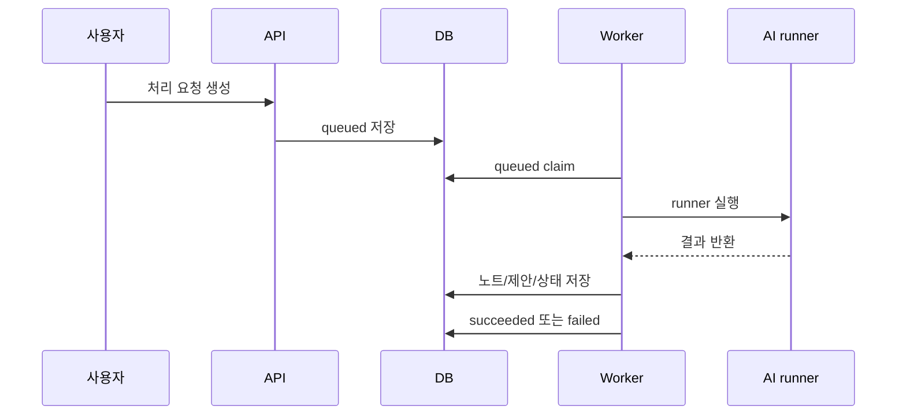

# 요청 생명주기

처리 요청은 사용자의 메모를 AI runner에 전달하고 결과를 노트와 mirror에 반영하기 위한 작업 단위다.

## 상태

| 상태 | 의미 |
| --- | --- |
| `queued` | 처리 대기 |
| `running` | worker가 claim하여 실행 중 |
| `succeeded` | 정상 완료 |
| `failed` | 실패했으며 재시도 가능 여부를 확인해야 함 |
| `cancelled` | 운영자 또는 시스템이 취소 |
| `needs_sync` | 대상 노트 또는 저장소 상태가 맞지 않아 재처리 필요 |

## 생성 경로

- 웹 워크벤치에서 `AI로 처리`
- 웹 워크벤치에서 `AI 재분석`
- 문서 피드백 저장 후 `재처리`
- API 기반 선택 클라이언트의 명시적 요청

## 실행 흐름

## 재시도와 취소

- 실패 요청은 retry 정책에 따라 다시 `queued`가 될 수 있다.
- 최대 시도 횟수를 넘으면 운영자 검토가 필요하다.
- 아직 실행되지 않은 `queued` 요청은 즉시 취소할 수 있다.
- `running` 요청은 상태상 취소할 수 있지만 외부 프로세스가 즉시 멈춘다는 보장은 없다.
- 삭제된 노트와 연결된 요청은 결과 반영 전에 대상 존재 여부를 다시 확인한다.
