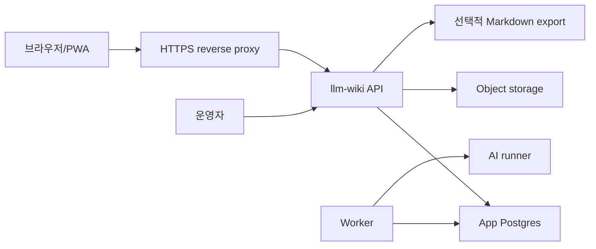

# 설치 매뉴얼

이 문서는 `llm-wiki`를 새 서버에 배포하려는 사람을 위한 상세 안내서다. 처음 설치하는 경우에는 먼저 [처음 설치 가이드](../INSTALL.md)를 따른다. 모든 값은 예시이며, 실제 운영값은 서버 전용 `.env`에만 둔다.

## 대상 독자

- Ubuntu 서버에 Docker Compose 기반 서비스를 설치하는 사람
- object storage, reverse proxy, 선택적 Markdown mirror를 연결하는 사람
- AI runner, 백업, 알림을 운영 가능한 상태로 만드는 사람

## 목표 구조



## 준비물

- Ubuntu 서버
- Docker와 Docker Compose plugin
- HTTPS reverse proxy와 도메인
- S3 호환 object storage. 별도 object storage가 없다면 앱 compose의 내장 MinIO profile을 사용할 수 있다.
- Codex CLI 로그인 또는 OpenAI API key
- 선택 사항: Markdown mirror를 둘 host 디렉터리

## 디렉터리 예시

```text
/home/YOUR_USER/projects/llm-wiki
/home/YOUR_USER/services/llm-wiki-app
/home/YOUR_USER/services/object-storage
/home/YOUR_USER/services/llm-wiki-app/minio
/home/YOUR_USER/services/llm-wiki-app/mirror
```

## 소스 가져오기

```bash
mkdir -p /home/YOUR_USER/projects
cd /home/YOUR_USER/projects
git clone https://github.com/OWNER/llm-wiki.git llm-wiki
cd llm-wiki
```

## 앱 환경 파일

```bash
mkdir -p /home/YOUR_USER/services/llm-wiki-app
cp deploy/llm-wiki-app/docker-compose.yml /home/YOUR_USER/services/llm-wiki-app/docker-compose.yml
cp deploy/llm-wiki-app/.env.example /home/YOUR_USER/services/llm-wiki-app/.env
chmod 600 /home/YOUR_USER/services/llm-wiki-app/.env
```

필수로 바꿀 값:

- `APP_DB_PASSWORD`
- `APP_ADMIN_TOKEN`
- `APP_PLUGIN_TOKEN`: 외부 클라이언트 API용 토큰. 기본 웹 사용만 해도 랜덤값을 설정한다.
- `APP_BASE_URL`
- `APP_DEFAULT_WORKFLOW_MODE`: 공개/범용 배포는 `generic`, 개인 서버를 바로 개인 운영 모드로 시작하려면 `personal`
- `S3_ENDPOINT`
- `S3_ACCESS_KEY_ID`
- `S3_SECRET_ACCESS_KEY`
- `LLM_WIKI_SOURCE_ROOT`

별도 object storage를 쓰는 경우에는 해당 endpoint와 credential을 입력한다. 내장 MinIO를 쓰는 경우에는 `S3_ENDPOINT=http://minio:9000`을 유지하고 `S3_ACCESS_KEY_ID`/`S3_SECRET_ACCESS_KEY` 값을 `MINIO_ROOT_USER`/`MINIO_ROOT_PASSWORD`와 맞춘다.

`.env.example`의 `change-me*`, `placeholder`, `replace-me*` 예제값은 실제 실행 시 거부된다. 복사 직후 관리자 토큰, 외부 클라이언트 토큰, DB 비밀번호, object storage 비밀번호를 모두 새 랜덤값으로 바꾼다.

`deploy/llm-wiki-app/docker-compose.yml`은 `LLM_WIKI_SOURCE_ROOT` 환경변수를 요구한다. `.env` 또는 shell 환경에 설정한다. Markdown export mirror 경로를 직접 지정하려면 선택적으로 `LLM_WIKI_MIRROR_ROOT`를 설정한다. `APP_REPO_FULL_NAME`은 기존 요청 테이블의 앱 식별자이며 Git remote 설정이 아니다. 웹 노트 AI 처리는 `DB_NOTE_RUN_ROOT` 아래 임시 작업공간에서 동작하므로 Git checkout이 필요하지 않다. 기본 설치에서는 `MIRROR_GIT_PUSH_ENABLED=false`를 유지한다.

API와 내장 MinIO published port는 기본적으로 `127.0.0.1`에만 bind된다. 공개 URL은 reverse proxy에서 `http://127.0.0.1:8080`으로 전달하는 구성을 권장한다.

`APP_DEFAULT_WORKFLOW_MODE`는 DB에 개인화 설정 row가 아직 없을 때만 적용된다. 설정 화면에서 개인화 기본값을 한 번 저장하면 이후에는 DB 값이 우선한다.

`DAILY_DIGEST_ENABLED=true`로 설정하면 worker가 개인화 설정의 `하루 요약 시간` 이후 하루 한 번 오늘 브리핑을 기본 알림 채널로 보낸다. 공개/범용 배포 템플릿의 기본값은 `false`이며, 개인 서버에서 PWA 또는 Telegram 알림 설정을 끝낸 뒤 켜는 것을 권장한다.

Markdown mirror는 원본 저장소가 아니라 DB에서 다시 만들 수 있는 산출물이다. mirror를 재생성하려면 다음 명령을 사용한다.

```bash
docker compose exec api llm-wiki notes-export --scope full --local-only --reconcile
```

삭제될 generated stale Markdown 파일을 먼저 확인하려면 dry-run으로 실행한다.

```bash
docker compose exec api llm-wiki notes-export --scope full --local-only --reconcile --dry-run
```

## 서비스 시작

```bash
cd /home/YOUR_USER/services/llm-wiki-app
docker compose up -d app-db api
docker compose --profile worker up -d
```

내장 MinIO까지 함께 띄우는 경우:

```bash
cd /home/YOUR_USER/services/llm-wiki-app
docker compose --profile minio up -d app-db api
docker compose --profile minio --profile worker up -d
```

## 초기 점검

```bash
curl -fsS http://127.0.0.1:8080/health
curl -fsS https://notes.example.com/health
```

웹 브라우저에서 `https://notes.example.com`을 열어 `/notes`로 이동하는지 확인한다.

## 공개 demo seed

빈 DB에서 워크벤치 흐름을 먼저 확인하려면 공개용 합성 샘플 데이터를 넣는다. 이 명령은 샘플 원문, 소스 노트, 주제/대상 승인 예시, 미검토/거절 제안, 일정 항목을 만든다. 기본 실행은 실제 알림 발송 대기열을 만들지 않는다.

```bash
cd /home/YOUR_USER/services/llm-wiki-app
docker compose exec api llm-wiki demo-seed --anchor-date 2026-07-01
```

브라우저 알림 대기열까지 확인해야 한다면 명시적으로 옵션을 추가한다.

```bash
docker compose exec api llm-wiki demo-seed --anchor-date 2026-07-01 --with-notifications
```

같은 기준일로 다시 실행해도 노트, 링크, 일정 항목은 중복 생성되지 않는다. 실행 후 `/notes`에서 `공개 배포 준비 회의 정리`, `공개 배포 준비`, `샘플 워크벤치`, `공개 발행 점검 마감`을 확인한다. 운영 데이터가 이미 있는 DB에도 실행할 수 있지만, 공개용 샘플이라는 표시가 붙은 데이터가 추가되므로 실제 개인 운영 DB에서는 필요할 때만 실행한다.

## AI 러너

기본 runner는 `codex-cli` 또는 `dry-run`으로 설정할 수 있다.

- ChatGPT 로그인 기반 Codex CLI를 쓰려면 컨테이너 안에서 로그인 상태를 확인한다.
- OpenAI API를 쓰려면 `OPENAI_API_KEY_FILE` 같은 server-only secret file을 사용한다.
- 공개 문서나 Git에는 실제 key를 남기지 않는다.

대화 화면의 최종 답변만 OpenAI API로 생성하려면 `CHAT_ANSWER_PROVIDER=openai-api`를 사용한다. 이 기능은 검색, 순위, 근거 선정을 바꾸지 않고 근거 기반 답변 문장만 생성한다.

비용과 응답 크기를 제한하려면 다음 값을 함께 설정한다.

- `CHAT_ANSWER_OPENAI_MAX_EVIDENCE_ITEMS`: OpenAI 답변 provider에 넘길 최대 근거 수
- `CHAT_ANSWER_OPENAI_MAX_PROMPT_CHARS`: provider에 넘기는 prompt 최대 문자 수
- `CHAT_ANSWER_OPENAI_MAX_OUTPUT_TOKENS`: 모델 출력 token 상한
- `CHAT_ANSWER_OPENAI_INPUT_COST_PER_1M_TOKENS`: 입력 100만 token당 비용. 비워 두면 비용 추정을 표시하지 않는다.
- `CHAT_ANSWER_OPENAI_OUTPUT_COST_PER_1M_TOKENS`: 출력 100만 token당 비용. 비워 두면 비용 추정을 표시하지 않는다.

prompt가 `CHAT_ANSWER_OPENAI_MAX_PROMPT_CHARS`를 넘으면 OpenAI API를 호출하지 않고 규칙 기반 답변으로 전환한다.
비용 단가는 모델과 시점에 따라 바뀔 수 있으므로 공개 템플릿에는 값을 넣지 않는다. 운영자는 사용하는 모델의 현재 가격을 확인한 뒤 서버 `.env`에 직접 입력한다.

## 알림

PWA Push를 쓰려면 VAPID key pair를 서버 전용 secret으로 설정한다.

- `PWA_VAPID_PUBLIC_KEY`
- `PWA_VAPID_PRIVATE_KEY` 또는 `PWA_VAPID_PRIVATE_KEY_FILE`
- `PWA_VAPID_SUBJECT`

Telegram은 선택 사항이다.

- `TELEGRAM_BOT_TOKEN` 또는 `TELEGRAM_BOT_TOKEN_FILE`
- `TELEGRAM_CHAT_ID`
- `TELEGRAM_WEBHOOK_SECRET` 또는 `TELEGRAM_WEBHOOK_SECRET_FILE`
- `TELEGRAM_POLLING_ENABLED`
- `DAILY_DIGEST_ENABLED`: 하루 요약 자동 발송을 켤 때 사용한다.

브라우저 상단의 `설정` 화면에서 개인화 기본값, PWA와 Telegram 설정 상태를 확인하고 테스트 알림을 보낼 수 있다. 설정 화면은 토큰 본문이나 chat id 값을 표시하지 않는다. 기본 화면에는 운영 모드, 기본 시간대, 일정 조회 범위, 하루 요약 시간, 선호 알림 채널과 핵심 개인화 요약이 보이며, 세부 개인화 필드는 `고급 개인화 설정`을 펼쳐 조정한다. 저장한 기본 시간대, 개인 용어, 분류 기준, 기록 전용 용어, 후속 확인 용어, 자주 등장하는 사람/장소/프로젝트/생활 카테고리는 이후 AI 처리와 재분석의 해석 힌트로 전달된다.

Telegram으로 명령을 받는 방식은 두 가지다.

1. `polling`: 서버가 Telegram API를 주기적으로 조회한다. 서버가 외부에서 직접 접근되지 않거나 reverse proxy, 방화벽, NAT 환경이 복잡하면 이 방식을 권장한다.
2. `webhook`: Telegram이 `POST /api/telegram/webhook`으로 직접 요청한다. 공개 HTTPS URL이 Telegram 서버에서 안정적으로 접근 가능해야 한다.

polling을 쓰려면 `.env`에서 `TELEGRAM_POLLING_ENABLED=true`로 바꾸고 poller profile을 실행한다.

```bash
cd /home/YOUR_USER/services/llm-wiki-app
docker compose --profile telegram up -d telegram-poller
```

polling은 webhook이 이미 등록되어 있으면 시작 시 `deleteWebhook`을 호출해 polling으로 전환한다. 이때 대기 중인 update는 삭제하지 않는다.

webhook을 쓰려면 bot webhook을 다음 형식으로 등록한다. secret token은 서버 전용 `.env`의 `TELEGRAM_WEBHOOK_SECRET` 값과 같아야 한다.

```bash
curl -X POST "https://api.telegram.org/bot${TELEGRAM_BOT_TOKEN}/setWebhook" \
  -d "url=https://notes.example.com/api/telegram/webhook" \
  -d "secret_token=${TELEGRAM_WEBHOOK_SECRET}"
```

지원하는 기본 명령:

- `/note <내용>`: Telegram에서 빠르게 작성중 메모를 저장하고 AI 처리를 요청
- `/capture <내용>`: `/note`와 동일
- `/chat <질문>` 또는 `/ask <질문>`: 노트, 일정, 알림을 대상으로 질문
- `/suggestions`: 미검토 제안 목록
- `/approve <id>`: 제안 승인
- `/reject <id>`: 제안 거절
- `/schedule`: 남은 일정/할 일
- `/notifications`: 알림 예정과 최근 발송
- `/today`: 오늘 브리핑

`/note`와 `/capture`는 입력한 원문을 작성중 노트로 저장한 뒤 DB 노트 처리 요청을 큐에 넣는다. `/chat`과 `/ask`는 Telegram 전용 대화 세션에 저장되어 다음 질문에서 이전 대화 맥락을 사용할 수 있다.

`/suggestions`는 미검토 제안별로 `승인`/`거절` 버튼을 우선 보낸다. 버튼을 누를 수 없는 환경에서는 목록에 표시된 짧은 ID로 `/approve <id>` 또는 `/reject <id>` 명령을 직접 입력한다.

## 백업

```bash
APP_ROOT=/home/YOUR_USER/services/llm-wiki-app \
sh /home/YOUR_USER/projects/llm-wiki/deploy/llm-wiki-app/run-backup.sh
```

백업이 정상 생성되고 restore smoke가 통과한 뒤 cron에 등록한다.

기본 restore smoke는 `restore-smoke-db` 임시 컨테이너를 사용한다. 별도 Postgres를 미리 준비할 필요는 없지만, 운영 DB와 같은 URL을 restore smoke 대상으로 지정하면 안 된다.

Git mirror 백업은 선택 사항이다. 별도 Git mirror를 운영하고 bundle이 필요하면 `REPO_BUNDLE_BACKUP_ENABLED=true`를 지정한다. 기본 복구 기준은 App DB dump와 object archive다.

## 공개 저장소 주의

- `.env`를 커밋하지 않는다.
- 실제 도메인, 내부 IP, 개인 이메일, 개인 경로를 문서에 남기지 않는다.
- 운영 검증 로그는 private notes에 기록한다.
- 공개 demo seed와 테스트 fixture는 합성 데이터만 사용하고, 실제 개인 메모나 개인화 설정에서 값을 가져오지 않는다.
