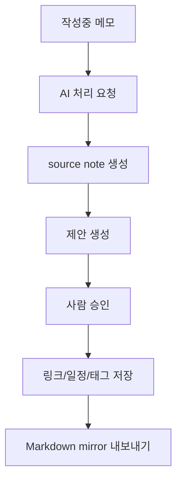

# 웹서비스 아키텍처

`llm-wiki`의 목표 구조는 웹 워크벤치를 중심으로 한 DB-canonical 메모 서비스다.

## 설계 목표

- 사용자는 한 화면에서 작성, 분석, 검토, 검색, 대화를 처리한다.
- DB가 노트와 리비전의 canonical storage가 된다.
- Git/Markdown은 감사 가능한 mirror와 선택적 외부 소비 경로로 사용한다.
- AI가 자동으로 결론을 확정하지 않고, 사람의 승인 단계를 둔다.

## 데이터 모델 요약

| 테이블 | 목적 |
| --- | --- |
| `notes` | 노트 본문, 종류, 상태, 메타데이터 |
| `note_revisions` | 노트 버전 기록 |
| `note_links` | source-topic-entity 관계 |
| `note_assets` | 첨부파일 메타데이터 |
| `processing_requests` | AI 처리 요청 |
| `processing_attachments` | 처리 요청에 포함된 업로드 첨부 메타데이터 |
| `processing_request_reviews` | 처리 요청 품질 검토 기록 |
| `note_feedback` | 문서 피드백 |
| `suggestion_decisions` | 제안 승인, 거절, 복원 상태 |
| `time_items` | 일정, 마감, 할 일, 예약 |
| `notification_subscriptions` | PWA Push 구독 |
| `notification_deliveries` | 알림 발송 이력 |
| `chat_sessions`, `chat_turns` | 대화 세션과 turn 기록 |
| `personalization_settings` | 운영 모드와 개인화 해석 힌트 |
| `daily_digest_runs` | 하루 요약 발송 이력 |
| `export_jobs` | Markdown mirror 내보내기 이력 |

## 처리 흐름

## UI 구조

- 좌측: 보기 선택, 검색, 필터, 목록
- 가운데: 편집기 또는 상세 화면
- 우측: 접을 수 있는 정보/작업 패널
- 모바일: 목록, 상세, 정보 탭으로 전환

## 보안 구조

- 브라우저는 same-origin API와 HttpOnly session cookie를 사용한다.
- API token은 서버와 신뢰된 client에만 둔다.
- 첨부파일은 object storage에 저장하고 DB에는 참조만 둔다.
- AI runner에는 필요한 최소 환경변수만 전달한다.
